# black.box
Repository to Reproduce Some Black Box Error using LabVIEW FPGA IP Export Utility.

# First, I created some LabVIEW FPGA IP and exported it using the FPGA IP Export to Netlist feature

## The Block Diagram of the IP I am importing
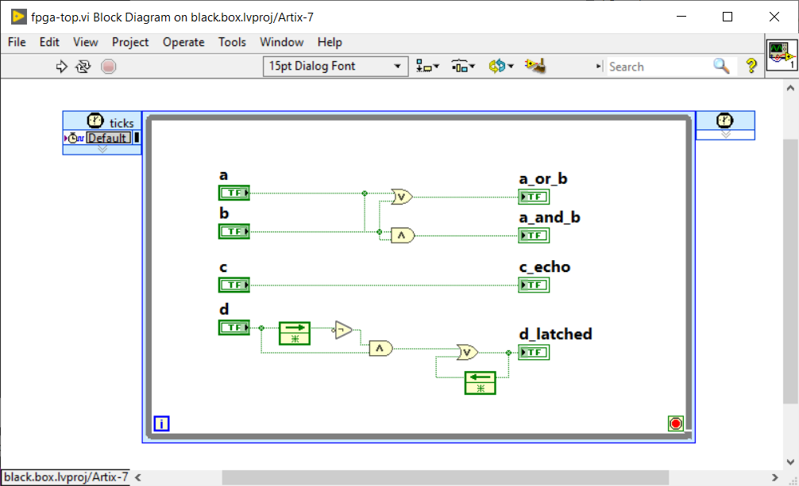

## The Front Panel of the IP I am importing
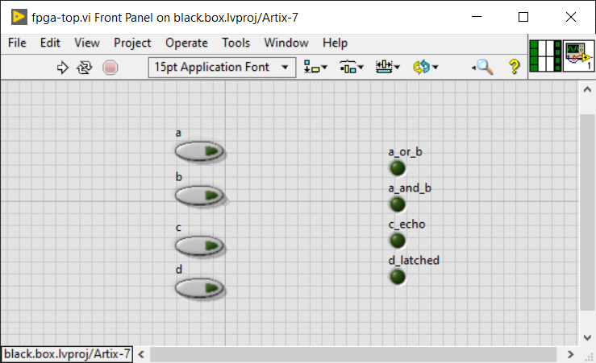

# Second, I created a MicroBlaze based Block Design for the Arty Artix-7 Board

# Then I create a file called my_wrapper.v with the following contents:
```
module my_wrapper(
    input wire clk,
    input wire resetn,
    input wire a,
    input wire b,
    input wire c,
    input wire d,
    output wire a_or_b,
    output wire a_and_b,
    output wire c_echo,
    output wire d_latched
    );

    NiFpgaIPWrapper_fpga_top ni_wrapper(
        .reset(0),
        .enable_in(1),
        .enable_out(),
        .enable_clr(0),
        .ctrlind_00_d(d),
        .ctrlind_01_d_latched(d_latched),
        .ctrlind_02_c(c),
        .ctrlind_03_c_echo(c_echo),
        .ctrlind_04_b(b),
        .ctrlind_05_a(a),
        .ctrlind_06_a_and_b(a_and_b),
        .ctrlind_07_a_or_b(a_or_b),
        .Clk40(clk)
    );

//    reg[2:0] delay;
//    reg d_saved;

//    reg a_or_b_out;
//    reg a_and_b_out;
//    reg c_echo_out;
//    reg d_latched_out;
//    assign a_or_b = a_or_b_out;
//    assign a_and_b = a_and_b_out;
//    assign c_echo = c_echo_out;
//    assign d_latched = d_latched_out;

//    always @ (posedge clk)
//    begin
//        if (~resetn)
//            begin
//                a_or_b_out = 0;
//                a_and_b_out = 0;
//                c_echo_out = 0;

//                delay = 0;
//                d_saved = 0;
//                d_latched_out = 0;
//            end
//        else
//            begin
//                a_or_b_out = a | b;
//                a_and_b_out = a & b;
//                c_echo_out = c;

//                delay[0] = delay[1];
//                delay[1] = d;
//                d_saved = d_saved | (d & ~delay[0]);
//                d_latched_out = d_saved | (d & ~delay[0]);
//            end
//    end
endmodule
```

## Then I right-click on it and select 'Add Module to Block Design'
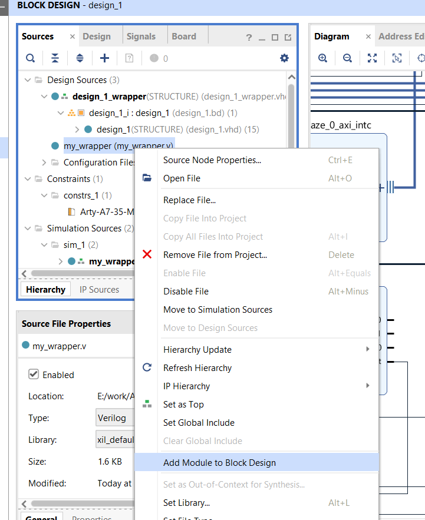

## Screen shot of sources with my_wrapper.vi added but before I add NI LabVIEW FPGA IP
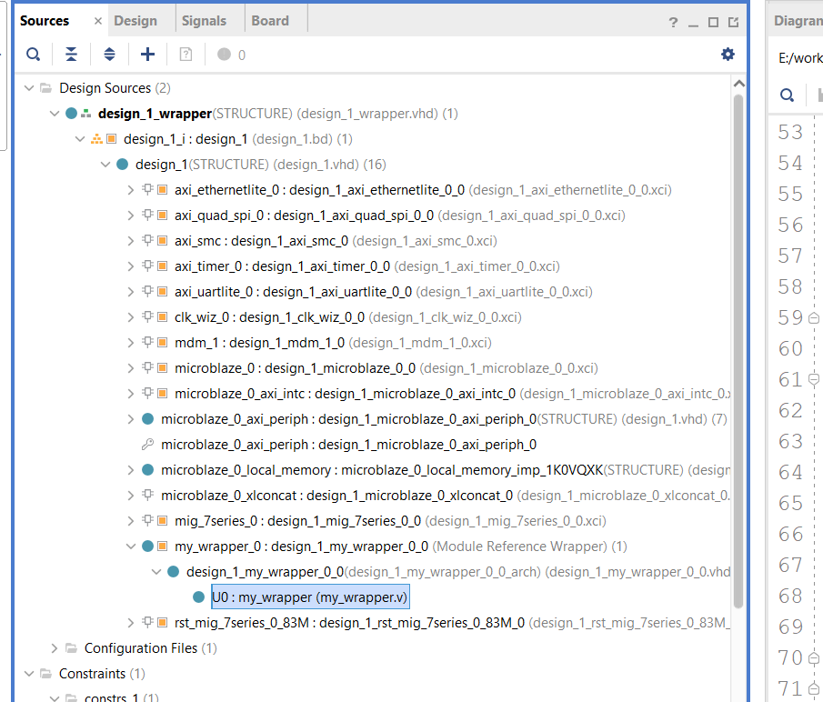

## Add both dcp and vhd wrapper for NI LabVIEW FPGA IP


## I did not select the 'Copy sources into project' option
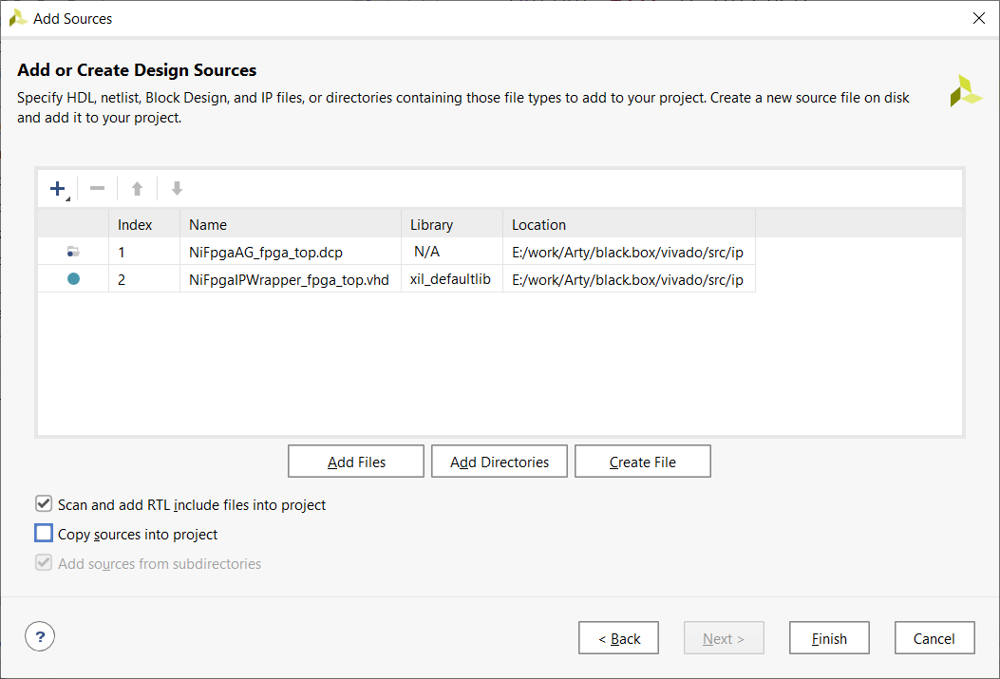

## I get my first error/warning about the dcp file
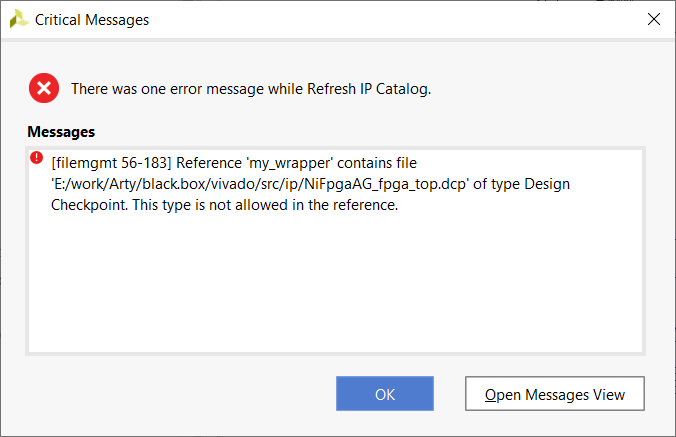

## So I select only the DCP from the hierarchy and uncheck 'USED_IN_SYNTHESIS'
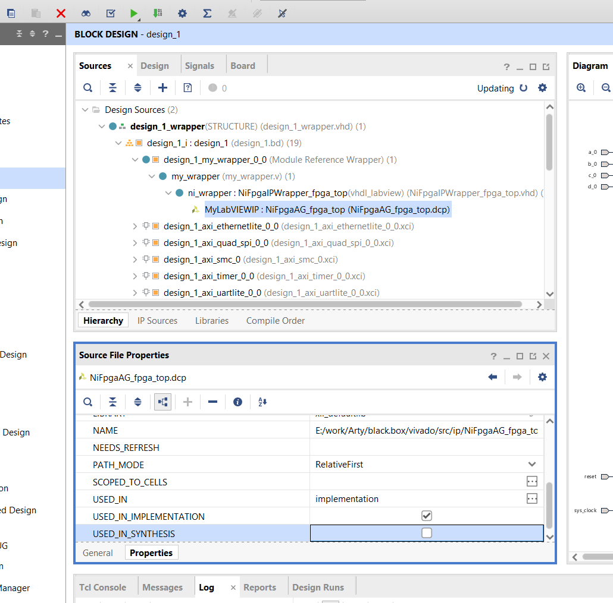

## Here is what it looks like
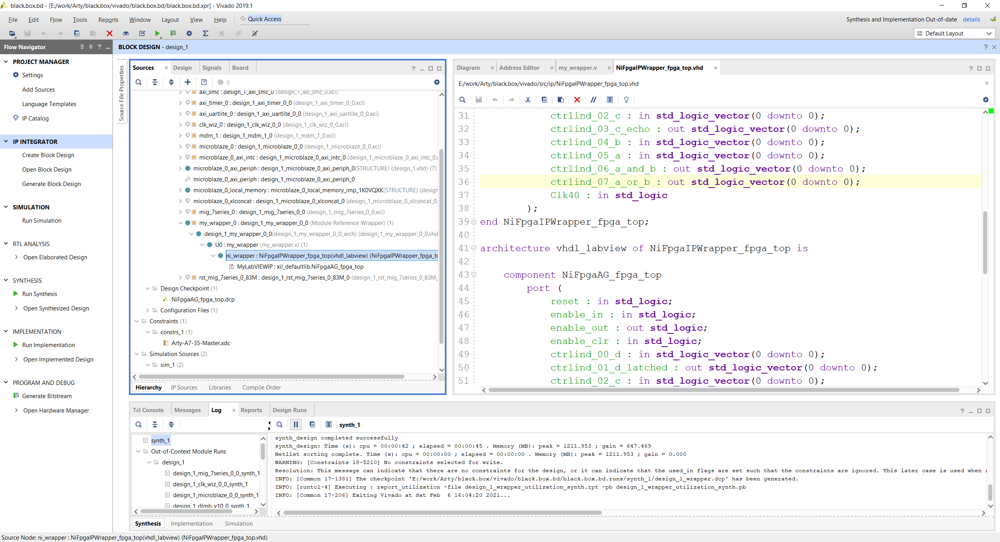

## I run Implementation
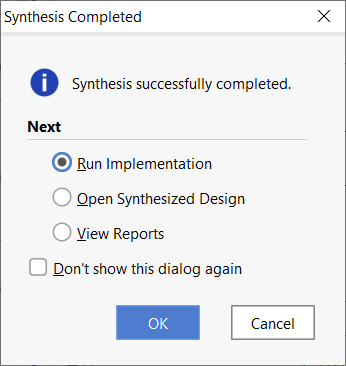

## And I get this error
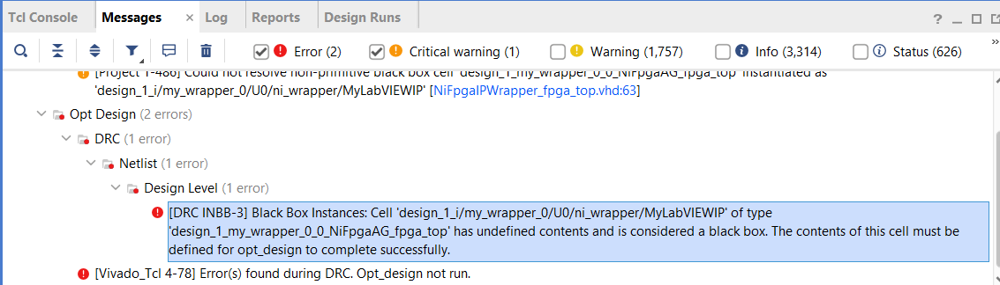

## The full Block Design
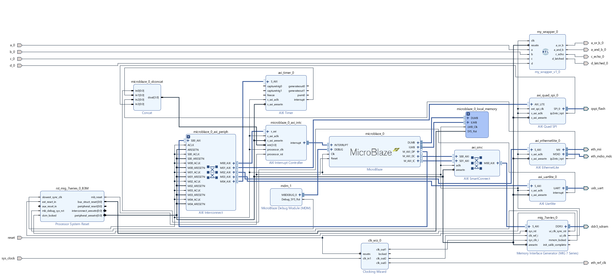

## A zoomed in version of the Block Design
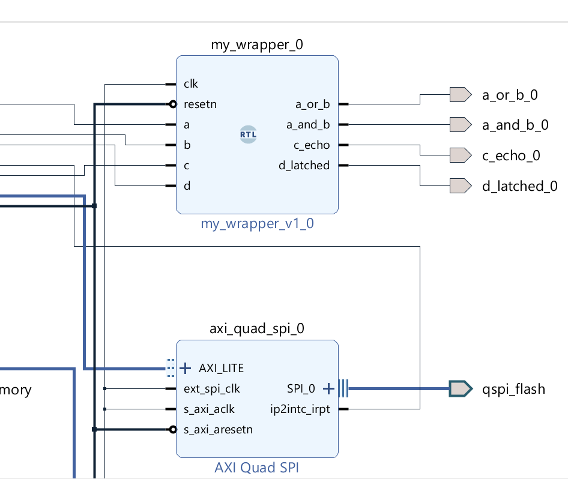


# Here is a snippet of the error message from the implementation log:
```
Generating merged BMM file for the design top 'design_1_wrapper'...
INFO: [Memdata 28-144] Successfully populated the BRAM INIT strings from the following elf files: e:/work/Arty/black.box/vivado/black.box.bd/black.box.bd.srcs/sources_1/bd/design_1/ip/design_1_microblaze_0_0/data/mb_bootloop_le.elf 
CRITICAL WARNING: [Project 1-486] Could not resolve non-primitive black box cell 'design_1_my_wrapper_0_0_NiFpgaAG_fpga_top' instantiated as 'design_1_i/my_wrapper_0/U0/ni_wrapper/MyLabVIEWIP' [E:/work/Arty/black.box/vivado/src/ip/NiFpgaIPWrapper_fpga_top.vhd:63]
Netlist sorting complete. Time (s): cpu = 00:00:00 ; elapsed = 00:00:00.054 . Memory (MB): peak = 1760.746 ; gain = 0.000
INFO: [Project 1-111] Unisim Transformation Summary:
  A total of 596 instances were transformed.
  IOBUF => IOBUF (IBUF, OBUFT): 7 instances
  IOBUFDS_INTERMDISABLE => IOBUFDS_INTERMDISABLE (IBUFDS_INTERMDISABLE_INT, IBUFDS_INTERMDISABLE_INT, INV, OBUFTDS, OBUFTDS): 2 instances
  IOBUF_INTERMDISABLE => IOBUF_INTERMDISABLE (IBUF_INTERMDISABLE, OBUFT): 16 instances
  LUT6_2 => LUT6_2 (LUT5, LUT6): 80 instances
  OBUFDS => OBUFDS_DUAL_BUF (INV, OBUFDS, OBUFDS): 1 instances
  RAM16X1D => RAM32X1D (RAMD32, RAMD32): 34 instances
  RAM16X1S => RAM32X1S (RAMS32): 4 instances
  RAM32M => RAM32M (RAMD32, RAMD32, RAMD32, RAMD32, RAMD32, RAMD32, RAMS32, RAMS32): 435 instances
  RAM32X1D => RAM32X1D (RAMD32, RAMD32): 6 instances
  RAM64M => RAM64M (RAMD64E, RAMD64E, RAMD64E, RAMD64E): 11 instances

39 Infos, 8 Warnings, 1 Critical Warnings and 0 Errors encountered.
link_design completed successfully
link_design: Time (s): cpu = 00:00:57 ; elapsed = 00:01:02 . Memory (MB): peak = 1760.746 ; gain = 1170.797
Command: opt_design
Attempting to get a license for feature 'Implementation' and/or device 'xc7a100t'
INFO: [Common 17-349] Got license for feature 'Implementation' and/or device 'xc7a100t'
Running DRC as a precondition to command opt_design

Starting DRC Task
INFO: [DRC 23-27] Running DRC with 2 threads
ERROR: [DRC INBB-3] Black Box Instances: Cell 'design_1_i/my_wrapper_0/U0/ni_wrapper/MyLabVIEWIP' of type 'design_1_my_wrapper_0_0_NiFpgaAG_fpga_top' has undefined contents and is considered a black box.  The contents of this cell must be defined for opt_design to complete successfully.
INFO: [Project 1-461] DRC finished with 1 Errors
INFO: [Project 1-462] Please refer to the DRC report (report_drc) for more information.
ERROR: [Vivado_Tcl 4-78] Error(s) found during DRC. Opt_design not run.

Time (s): cpu = 00:00:03 ; elapsed = 00:00:02 . Memory (MB): peak = 1760.746 ; gain = 0.000
INFO: [Common 17-83] Releasing license: Implementation
44 Infos, 8 Warnings, 1 Critical Warnings and 2 Errors encountered.
opt_design failed
ERROR: [Common 17-39] 'opt_design' failed due to earlier errors.

INFO: [Common 17-206] Exiting Vivado at Sun Feb  7 13:17:50 2021...
```
